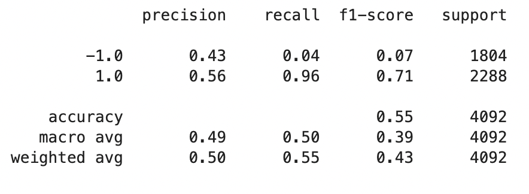
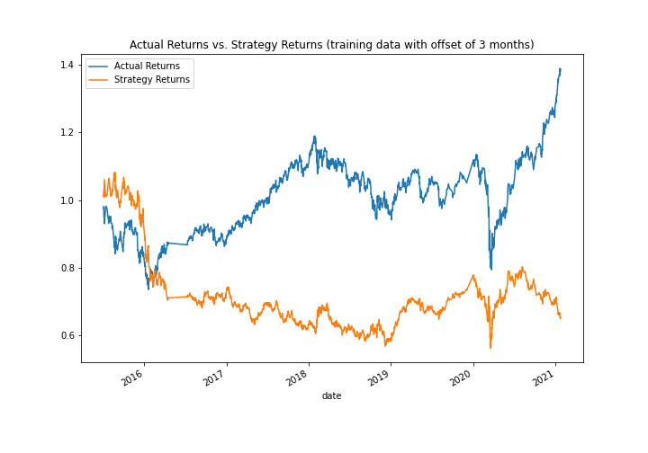

# Machine Learning Trading Bot

## Purpose of the Analysis
Many financial advisory firms manage and automatically trade assets by using computer algorithms that can buy and sell faster than human traders. While these programmed algorithms are useful, they need to be able to adapt to new data. In order to make these algorithmic trading systems adapt to new data, we can use machine learning algorithms. This repository uses algorithmic trading skills, Python programming, and machine learning to create an algorithmic trading bot that learns and adapts to new data and evolving markets.  

## Financial Information 
The data used for this repository is an MCSI-based emerging markets ETF that iShares issued. Investments in emerging markets often have higher long-term returns, but they carry more risk. The data includes the open, high, low, close, and volume (OHLCV) information from 01/21/2015 to 01/22/2021. There are 4,323 rows of data. 

## What Needs to be Predicted
The trading signals are set up so that the algorithm buys the stock long when the actual returns are greater than or equal to 0, and it sells the stock short when the actual returns are less than 0. 
```
# Initialize the new Signal column
signals_df['Signal'] = 0.0

# When Actual Returns are greater than or equal to 0, generate signal to buy stock long
signals_df.loc[(signals_df['Actual Returns'] >= 0), 'Signal'] = 1

# When Actual Returns are less than 0, generate signal to sell stock short
signals_df.loc[(signals_df['Actual Returns'] < 0), 'Signal'] = -1
```

For the machine learning algorithmic trading model, the y target is the signal. We will predict the signal (1 or -1) that indicates whether we should buy or sell. The X features are a copy of the SMA_Fast and SMA_Slow columns from the original DataFrame. We want to know how SMA_Fast and SMA_Slow will predict returns in the future. Therefore, we will use the shift function to shift the feature columns by 1, which ensures that the model will use the current values to predict the outcome for the next period.

---

## Methods 
1. **Establish a baseline performance:** Generate trading signals using short- and long-window SMA values, split data into training and testing sets, use the SVC classifier model from SKLearn's support vector machine (SVM) learning method to fit the training data and make predictions based on the testing data, review the classification report associated with the SVC model predictions, create a predictions DataFrame, create a cumulative return plot that shows the actual returns vs. the strategy returns
2. **Tune the baseline trading algorithm:** Adjust the size of the training dataset and adjust the SMA windows to see how it affects the algorithm. Rerun the notebook with the updated parameters and record the results. Try to find the  set of parameters that best improved the trading algorithm returns.
3. **Evaluate a new machine learning classifier:** Using the original training data as the baseline model, fit another model with the new classifier (i.e., Logistic Regression). Backtest the new model to evaluate its performance.

---

## Results 
This section discusses how tuning the baseline trading algorithm affected its performance. 

Baseline Report



Baseline Plot



* **Adjusting the size of the training dataset**

The training size was adjusted from 3 months to 7 months. Other time frames were attempted (i.e., 2 months, 6 months, 12 months, 16 months, 20 months), but 7 months provided the best improvement. It improved the accuracy by 1% (from 55% to 56%). It also improved the precision of the "-1" class by 2% (from 43% to 45%).  


* **Adjusting the SMA windows**

* **Combining the adjustments** 

* **New classifier model** 

---

## Summary Conclusions

---

## Contributors 
Catherine Croft

Email: catherinecroft1014@gmail.com

LinkedIn: [catherine-croft](https://www.linkedin.com/in/catherine-croft-4715481aa/)

---

## License 
MIT