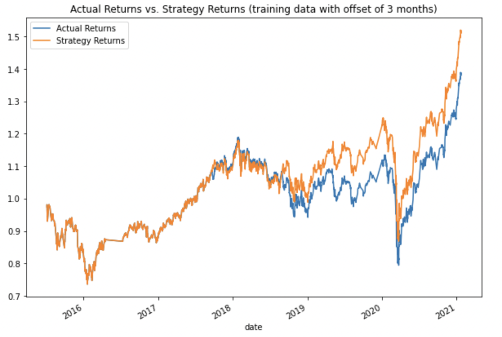
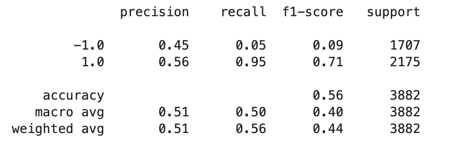
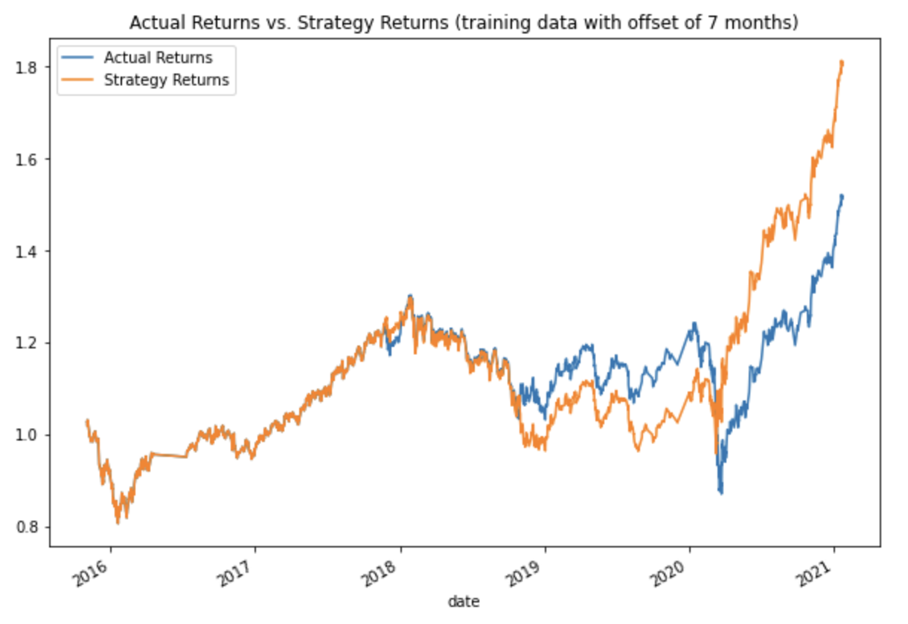
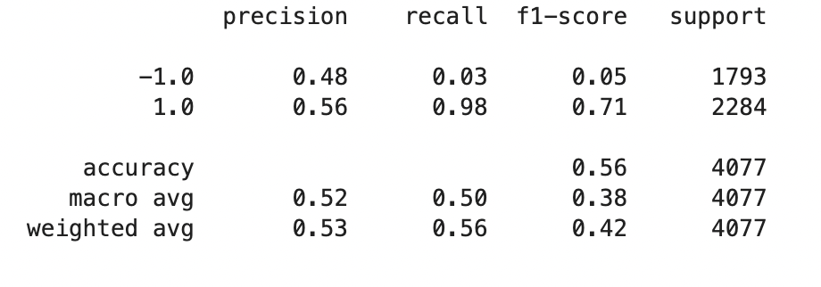
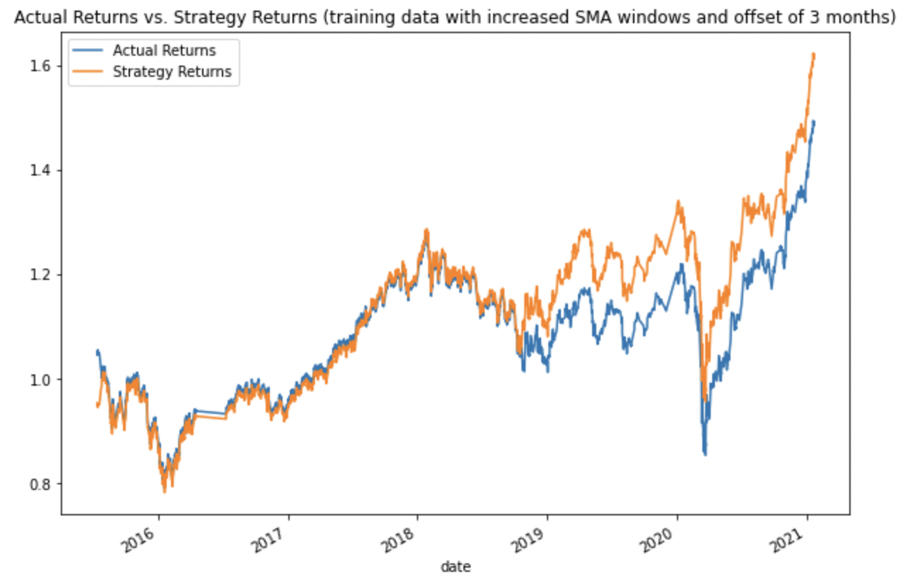
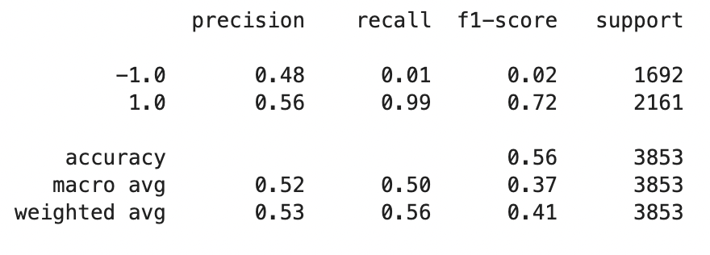
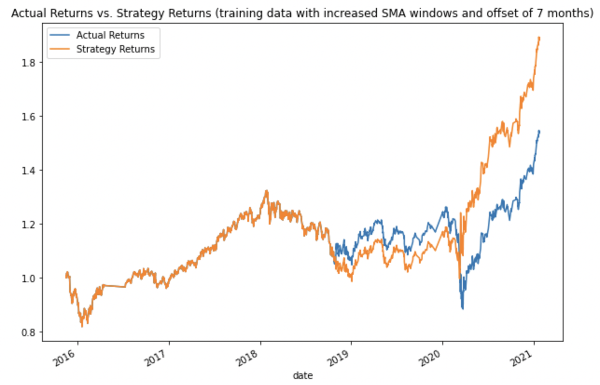
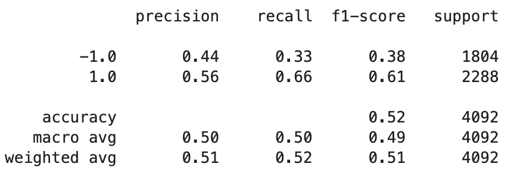
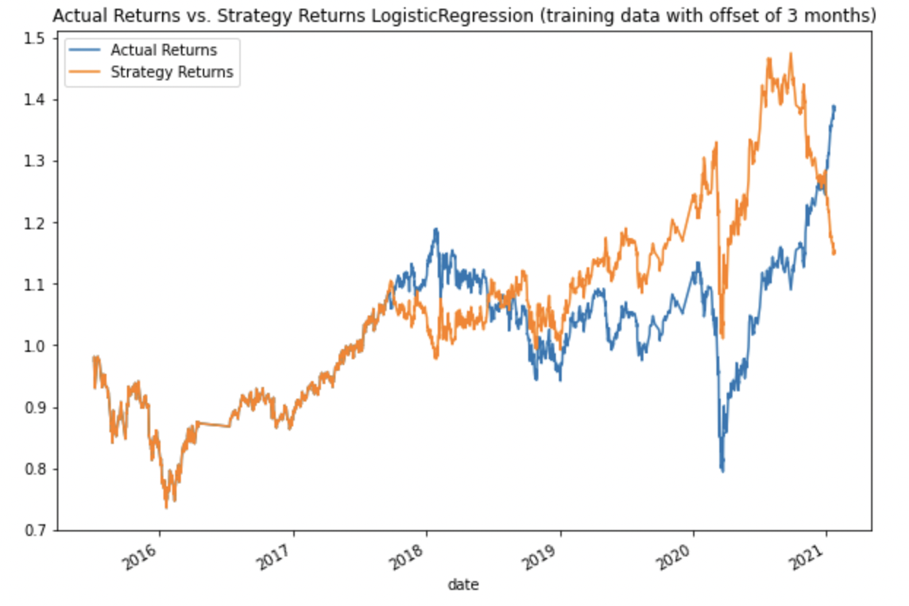

# Machine Learning Trading Bot

## Purpose of the Analysis
Many financial advisory firms manage and automatically trade assets by using computer algorithms that can buy and sell faster than human traders. While these programmed algorithms are useful, they need to be able to adapt to new data. In order to make these algorithmic trading systems adapt to new data, we can use machine learning algorithms. This repository uses algorithmic trading skills, Python programming, and machine learning to create an algorithmic trading bot that learns and adapts to new data and evolving markets.  

## Financial Information 
The data used for this repository is an MCSI-based emerging markets ETF that iShares issued. Investments in emerging markets often have higher long-term returns, but they carry more risk. The data includes the open, high, low, close, and volume (OHLCV) information from 01/21/2015 to 01/22/2021. There are 4,323 rows of data. 

## What Needs to be Predicted
The trading signals are set up so that the algorithm buys the stock long when the actual returns are greater than or equal to 0, and it sells the stock short when the actual returns are less than 0. 
```
# Initialize the new Signal column
signals_df['Signal'] = 0.0

# When Actual Returns are greater than or equal to 0, generate signal to buy stock long
signals_df.loc[(signals_df['Actual Returns'] >= 0), 'Signal'] = 1

# When Actual Returns are less than 0, generate signal to sell stock short
signals_df.loc[(signals_df['Actual Returns'] < 0), 'Signal'] = -1
```

For the machine learning algorithmic trading model, the y target is the signal. We will predict the signal (1 or -1) that indicates whether we should buy or sell. The X features are a copy of the SMA_Fast and SMA_Slow columns from the original DataFrame. We want to know how SMA_Fast and SMA_Slow will predict returns in the future. Therefore, we will use the shift function to shift the feature columns by 1, which ensures that the model will use the current values to predict the outcome for the next period.

---

## Methods 
1. **Establish a baseline performance:** Generate trading signals using short- and long-window SMA values, split data into training and testing sets, use the SVC classifier model from SKLearn's support vector machine (SVM) learning method to fit the training data and make predictions based on the testing data, review the classification report associated with the SVC model predictions, create a predictions DataFrame, create a cumulative return plot that shows the actual returns vs. the strategy returns
2. **Tune the baseline trading algorithm:** Adjust the size of the training dataset and adjust the SMA windows to see how it affects the algorithm. Rerun the notebook with the updated parameters and record the results. Try to find the  set of parameters that best improved the trading algorithm returns.
3. **Evaluate a new machine learning classifier:** Using the original training data as the baseline model, fit another model with the new classifier (i.e., Logistic Regression). Backtest the new model to evaluate its performance.

---

## Results 
This section discusses how tuning the baseline trading algorithm affected its performance. 

The baseline trading algorithm has an accuracy of 55%. It is better at predicting the "1" class than the "-1" class as the precision for the "1" class is 56% and the precision for the "-1" class is 43%. In addition, the recall for the "-1" class is much less than the recall for the "1" class (4% compared to 96%). Until 2019, the strategy and actual returns are pretty well matched to each other. Then, the strategy returns rise above the actual returns around 2019 and pretty much remain above through the end of the data in 2021. At the end of the data (beginning of 2021), the strategy returns are above the actual returns by a little over 10%.  

Baseline Report


Baseline Plot



* **Adjusting the size of the training dataset:** The training size was adjusted from 3 months to 7 months. Other sizes were attempted (i.e., 2 months, 6 months, 12 months, 16 months, 20 months), but 7 months provided the best improvement. It improved the accuracy by 1% (from 55% to 56%). It also improved the precision of the "-1" class by 2% (from 43% to 45%). The recall for the "-1" class is still low, but it improved from 4% to 5%. The algorithm is still better at predicting the "1" class compared to the "-1" class. When looking at the plot, the actual returns were above the strategy returns from the end of 2018 to the beginning of 2020. Then, the strategy returns are higher than the actual returns from early 2020 to early 2021. At the end of the data (beginning of 2021), the strategy returns are above the actual returns by a little over 30%.   

7-Month Offset Report



7-Month Offset Plot



* **Adjusting the SMA windows:** The SMA fast, short window was increased from 4 to 6, and the SMA slow, long window was increased from 100 to 140. Other window adjustments were attempted (i.e., 4;150, 6;100, 10;200, 8;180, 12;300), but a short window of 6 and a long window of 140 provided the best improvement. It improved the accuracy by 1% (from 55% to 56%). It also improved the precision of the "-1" class by 5% (from 43% to 48%). However, the recall for the "-1" class decreased from 4% to 3%, compared to the baseline classification report. The algorithm is still better at predicting the "1" class compared to the "-1" class. Looking at the plot, the strategy returns rise above the actual returns near the end of 2018, and they remain above to the beginning of 2021. At the end of the data (beginning of 2021), the strategy returns are above the actual returns by a little over 10%.    

Increase Windows Report



Increase Windows Plot



* **Combining the adjustments:** Since the above two adjustments improved the accuracy of the training algorithm, I combined them to see what the result would be. Therefore, I increased the training size to 7 months and increased the short- and long-windows to 6 and 140, respectively. This combination resulted in 56% accuracy, which is 1% better than the baseline but is the same as the above two adjustments. The precision of the "-1" class is 48%, which is 5% higher than the baseline; the precision of the "1" class is 56%, which is the same as the baseline. However, the recall for the "-1" class decreased to 1%, compared to the baseline 4%. The algorithm is still better at predicting the "1" class compared to the "-1" class. Looking at the plot, it naturally is a mix between the increased training size plot and the increased windows plot. It more closely resembles the increased training size plot in that the the actual returns were above the strategy returns from the end of 2018 to the beginning of 2020. However, there is a smaller gap between the actual returns and the strategy returns; the actual returns aren't that much higher than the strategy returns. Then, the strategy returns are higher than the actual returns from early 2020 to early 2021. There is a larger gap here, meaning the strategy returns are even higher than the actual returns compared to previous plots. At the end of the data (beginning of 2021), the strategy returns are above the actual returns by approximately 45%. This is the highest perentage that the strategy returns have been above the actual returns.         

Increase Size and Windows Report



Increase Size and Windows Plot



* **New classifier model:** I chose to look at how using a logistic regression model would affect the algorithm. The logistic regression model resulted in an accuracy of 52%, which is 3% lower than the baseline. The precision of the "-1" class is 44%, which is 1% higher than the baseline. The precision of the "1" class is the same at 56%. The recall for the "-1" class is higher than it has been for any of the trials; it is 33% for the "-1" class and 66% for the "1" class. Again, the algorithm is still better at predicting the "1" class compared to the "-1" class. From the end of 2017 to mid-2018, the strategy returns are lower than the actual returns. Then, the strategy returns go above the actual returns from around the end of 2018 to almost the end of 2020. At the beginning of 2021, the strategy returns actually go below the actual returns. At the end of the data (beginning of 2021), the actual returns were above the strategy returns by about 25%. 

Logistic Regression Report



Logistic Regression Plot



---

## Summary Conclusions
In conclusion, the ultimate goal was to have higher strategy returns than actual returns. By combining the increase in training size and the increase in the SMA windows, the strategy returns were above the actual returns by approximately 45% at the beginning of 2021. Compared to the other algorithms, this was the highest that the strategy returns were above the actual returns. However, the algorithm wasn't perfect as the strategy returns did dip below the actual returns in the end of 2018 to the beginning of 2020. It also had really poor recall for the "-1" class. It was better at predicting the "1" class compared to the "-1" class. The best the combination algorithm was able to do was increase the accuracy by 1% and increase the precision of the "-1" class by 5%. It was hard to find an algorithm that produced a higher accuracy and a more balanced identification of "1" and "-1" classes. 

When using the logistic regression model, it performed worse than the baseline model as the accuracy decreased by 3%. At the end of the data (beginning of 2021), the actual returns were above the strategy returns by about 25%. The strategy returns were above the actual returns at some points (i.e., from around the end of 2018 to almost the end of 2020). However, since the overall accruacy of the logistic regression model is lower than the baseline SVC classifier model, it doesn't seem like a better option for the algorithm. Logistic regression models are not the best with complex, volatile data. Therefore, it must have had a hard time predicting the classes due to the volatility of the data. 

In all, determining the best algorithm depends on the data that you are working with. There is a lot of trial and error in which you need to try out different model types, fine tune the training size and SMA windows, and feed it sufficient and relevant data. If you are interested in long-term trends for a stock with less volatility, you might increase the training size (increase training month offset). If you are interested in the short-term trends for a stock with high volatility, you might want to use a lower training size (lower training month offset).   

---

## Contributors 
Catherine Croft

Email: catherinecroft1014@gmail.com

LinkedIn: [catherine-croft](https://www.linkedin.com/in/catherine-croft-4715481aa/)

---

## License 
MIT